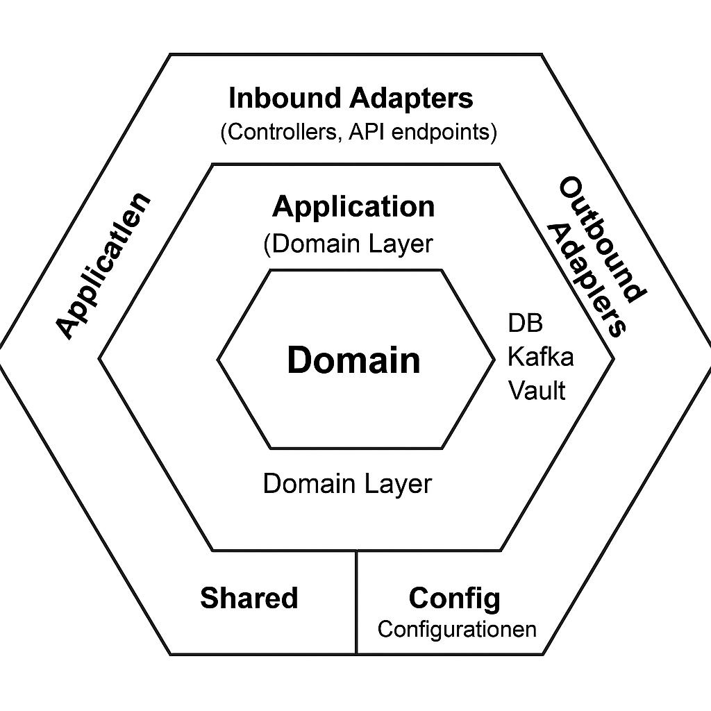

# 📽️ Template Service

## 📌 Project Status

[](https://github.com/marcoslozina/template-service/actions/workflows/ci.yml)
[](https://sonarcloud.io/summary/new_code?id=marcoslozina_template-service)
[](https://sonarcloud.io/summary/new_code?id=marcoslozina_template-service)
[](https://github.com/marcoslozina/template-service/releases)


---

## 🌱 Overview

**Template Service** is a production-ready backend starter built with **Hexagonal Architecture**, reactive programming, and cloud-native best practices.  
It provides a clean and extensible foundation for building secure, observable, and testable microservices.

---

## 📏 Architecture Diagram



---

## 🛠️ Technology Stack by Layer

### 🛋️ Development

[](https://openjdk.org/)
[](https://spring.io/projects/spring-boot)
[](https://gradle.org/)
[](https://docs.spring.io/spring-framework/docs/current/reference/html/web-reactive.html)
[](https://r2dbc.io/)

> Java 23, Spring Boot 3.4.4, Gradle Kotlin DSL and WebFlux for reactive backend development.

### 🔐 Security

[](https://www.vaultproject.io/)
[](https://oauth.net/2/)
[](https://spring.io/projects/spring-security)

> OAuth2 Resource Server, Role-Based Access Control (RBAC), and Vault for secure credentials.

### 🔄 CI / CD

[](https://docs.github.com/en/actions)
[](https://github.com/marcoslozina/template-service/releases)
[](https://github.com/ben-manes/gradle-versions-plugin)

> Fully automated CI/CD pipeline for testing, formatting, code analysis, and versioned releases. Weekly dependency check included.

### 🌍 Security & Vulnerabilities

[](https://owasp.org/www-project-dependency-check/)

> Runs `OWASP Dependency Check` on schedule to detect vulnerabilities in 3rd-party libraries.

### 📈 Observability

[](https://prometheus.io/)
[](https://grafana.com/)
[](https://grafana.com/oss/loki/)
[](https://www.elastic.co/logstash)

> Metrics via Micrometer + Prometheus, dashboards via Grafana, and structured logging using Logstash.

### 📊 Code Quality

[](https://www.jacoco.org/jacoco/)
[](https://sonarcloud.io/dashboard?id=marcoslozina_template-service)
[](https://www.archunit.org/)
[](https://checkstyle.org/)
[](https://pmd.github.io/)

> Code coverage, static analysis, and architectural constraints automatically enforced via CI.

### 🖌️ Style & Formatting

[](https://github.com/diffplug/spotless)
[](https://github.com/google/google-java-format)
[](https://checkstyle.org/)
> Consistent code formatting enforced automatically with Spotless + Google Java Format.

---

## 📦 Build & Run Commands

```bash
# Clean, build, and run tests
./gradlew clean build

# Run the app
./gradlew bootRun

# Run unit tests
./gradlew test

# Run architecture tests
./gradlew archTest

# Run code formatting check
./gradlew spotlessCheck

# Generate Jacoco report
./gradlew jacocoTestReport

# Check dependency updates
./gradlew dependencyUpdates -Drevision=release

# Run security dependency audit
./gradlew dependencyCheckAnalyze
```

---

## 📂 Project Structure

```text
src/
 ├── main/
 │    ├── java/
 │    │    └── com/company/templateservice/
 │    │         ├── application/   # Application services (use cases)
 │    │         ├── domain/         # Core domain models and business logic
 │    │         ├── infrastructure/ # Outbound adapters (DB, Kafka, Vault, etc.)
 │    │         ├── adapter/         # Inbound adapters (controllers, API endpoints)
 │    │         ├── shared/          # Shared utilities, exceptions, constants
 │    │         └── config/          # Spring Boot configuration classes
 │    └── resources/                # Application properties, YAML configs
 └── test/
      └── java/
           └── com/company/templateservice/
                ├── application/   # Application layer unit tests
                ├── domain/         # Domain model and business rule tests
                ├── infrastructure/ # Infrastructure integration tests
                ├── adapter/        # API/controller endpoint tests
                ├── shared/         # Shared utils testing
                └── integration/    # Full end-to-end integration tests
Dockerfile
build.gradle.kts
settings.gradle.kts
README.md
docker-compose.yml
```

---

## 🤝 Contributing

1. Fork this repo
2. Clone it locally
3. Create a new feature branch
4. Commit and push your changes
5. Open a pull request

---

## 📜 License

Licensed under the MIT License. See [`LICENSE`](LICENSE) for more.

---

> Made with ❤️ by [@marcoslozina](https://github.com/marcoslozina)

