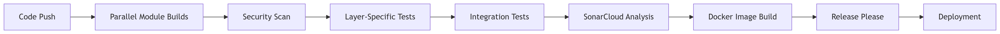

# 🚀 Reactive Microservice Template (Multi-Module)

## 📊 Project Health

[](https://github.com/marcoslozina/java-springboot-reactive-hexagonal-multimodule-template/actions/workflows/ci.yml)

[](https://sonarcloud.io/summary/new_code?id=marcoslozina_java-springboot-reactive-hexagonal-multimodule-template)


[](https://github.com/marcoslozina/java-springboot-reactive-hexagonal-multimodule-template/releases)


## 🌟 Overview

Plantilla productiva de microservicio reactivo con Spring Boot 3.2, basada en Arquitectura Hexagonal, diseñada con Java 21 y WebFlux para entornos cloud-native.

## ✨ Beneficios de la Arquitectura

- 🧱 Fronteras modulares estrictas
- ↔️ Flujo de dependencias claro: `domain ← application ← adapters`
- 🧪 Testabilidad independiente por capa
- 🚀 Builds paralelos por módulo
- 🔒 Configuraciones de seguridad aisladas

## 🛠️ Stack Tecnológico

### Framework Principal

| Componente     | Versión | Módulo         |
|----------------|---------|----------------|
| Java           | 21      | Todos          |
| Spring Boot    | 3.2.5   | Infrastructure |
| Spring WebFlux | 3.2.5   | Adapters:In    |
| Gradle (KTS)   | 8.7     | Raíz           |

### Persistencia

| Componente | Versión | Módulo       |
|------------|---------|--------------|
| R2DBC      | 3.2.5   | Adapters:Out |
| Flyway     | 9.22.3  | Adapters:Out |

### Observabilidad

| Componente       | Versión | Módulo         |
|------------------|---------|----------------|
| Micrometer       | 1.12.3  | Infrastructure |
| Logstash Logback | 7.4     | Shared         |
| SonarCloud       | Latest  | CI/CD          |

### Seguridad

| Componente       | Versión | Uso                          |
|------------------|---------|-------------------------------|
| Dependabot       | Latest  | Actualización dependencias    |
| GitHub Security  | Latest  | Alertas vulnerabilidades      |
| OWASP DC         | 8.4.1   | Escaneo CI/CD                 |

## 🔄 CI/CD Pipeline



### 🔧 Etapas del Pipeline

- **Build Paralelo**: Compilación independiente por módulo
- **Security Scan**:
    - OWASP Dependency Check
    - CodeQL Analysis
    - Dependabot alerts
- **Testing**:
    - Unit tests (por capa)
    - Integration tests (Testcontainers)
    - Architecture tests (ArchUnit)
- **Quality Gate**:
    - SonarCloud analysis
    - Coverage enforcement (80% mínimo)
- **Release**:
    - Versionado semántico automático
    - CHANGELOG generation
    - Artifact publication

## 🔍 Herramientas de Calidad y Seguridad

### 🔒 Seguridad Automatizada

- **Dependabot**: Actualización diaria de dependencias vulnerables
- **GitHub Security Alerts**: Monitoreo continuo de vulnerabilidades (CVE)
- **OWASP Dependency Check**: Escaneo en CI con reporte HTML
- **CodeQL**: Análisis estático de vulnerabilidades en el código

### 📊 Calidad de Código

- **SonarCloud**:
    - Análisis estático continuo
    - Reglas personalizadas para arquitectura hexagonal
    - Gate de calidad con métricas personalizadas
- **Release Please**:
    - Automatización de releases semánticas
    - Generación de `CHANGELOG.md`
    - Manejo de conventional commits

## 🚀 Getting Started

### 🔧 Comandos de Desarrollo

```bash
# Ejecutar con live reload
./gradlew :infrastructure:bootRun --continuous

# Ejecutar security scan local
./gradlew dependencyCheckAnalyze

# Generar reporte para SonarCloud
./gradlew jacocoRootReport sonarqube

# Ver dependencias vulnerables
./gradlew dependencyUpdates -Drevision=release
```

## 🔍 Security Workflow


## 🛡️ Políticas de Seguridad

- Escaneo diario automático de dependencias
- Bloqueo de merges con vulnerabilidades críticas
- Requerimiento de 2 approvals para actualizaciones mayores
- Notificaciones Slack para alertas de seguridad

## 📜 Licencia

Este proyecto está licenciado bajo la licencia MIT. Ver `LICENSE` para más detalles.

## 🔍 Security Policy

Para reportar vulnerabilidades de seguridad, por favor consulta nuestra Política de Seguridad y utiliza GitHub Security Advisories. Todas las vulnerabilidades serán investigadas dentro de las 24 horas.
