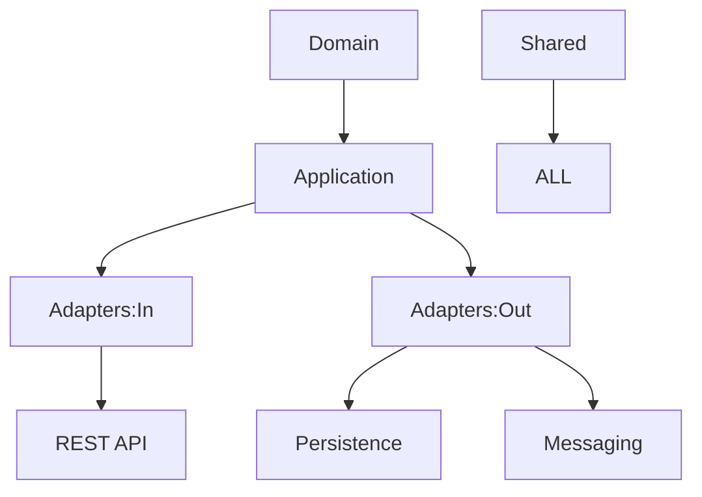
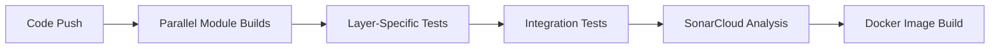

# 🚀 Reactive Microservice Template (Multi-Module)

## 📊 Project Health

[](https://github.com/marcoslozina/template-service/actions/workflows/ci.yml)
[](https://github.com/marcoslozina/template-service)
[](https://sonarcloud.io/summary/new_code?id=marcoslozina_template-service)
[](https://github.com/marcoslozina/template-service/security/dependabot)
[](https://github.com/marcoslozina/template-service/releases)
[](https://opensource.org/licenses/MIT)

---

## 🌟 Overview

Plantilla **productiva** de microservicio reactivo con Spring Boot 3.2, basada en **Arquitectura Hexagonal**, diseñada con Java 21 y WebFlux para entornos cloud-native.

### ✨ Beneficios de la Arquitectura

- 🧱 Fronteras modulares estrictas
- ↔️ Flujo de dependencias claro: `domain ← application ← adapters`
- 🧪 Testabilidad independiente por capa
- 🚀 Builds paralelos por módulo
- 🔒 Configuraciones de seguridad aisladas

---

## 🏗️ Estructura de Módulos



| Módulo           | Propósito                                               |
|------------------|----------------------------------------------------------|
| `:domain`        | Lógica de negocio y entidades puras (POJOs)              |
| `:application`   | Casos de uso (separados en comandos y consultas)         |
| `:adapters:in`   | Entrada (REST controllers, listeners)                    |
| `:adapters:out`  | Salida (BD, mensajería, servicios externos)              |
| `:infrastructure`| Configuración técnica (seguridad, monitoring, etc.)      |
| `:shared`        | Utilidades comunes, excepciones, helpers                 |

### ➕ Flujo de Dependencias

```
domain ← application ← adapters
  ↑           ↑            ↑
shared ───────┴────────────┘
```

---

## 🛠️ Stack Tecnológico

### Framework Principal

| Componente     | Versión | Módulo         |
|----------------|---------|----------------|
| Java           | 21      | Todos          |
| Spring Boot    | 3.2.5   | Infrastructure |
| Spring WebFlux | 3.2.5   | Adapters:In    |
| Gradle (KTS)   | 8.7     | Raíz           |

### Persistencia

| Componente | Versión | Módulo        |
|------------|---------|---------------|
| R2DBC      | 3.2.5   | Adapters:Out  |
| Flyway     | 9.22.3  | Adapters:Out  |

### Observabilidad

| Componente        | Versión | Módulo         |
|-------------------|---------|----------------|
| Micrometer        | 1.12.3  | Infrastructure |
| Logstash Logback  | 7.4     | Shared         |

---

## 🚀 Getting Started

### 🔧 Build por Módulo

```bash
# Compilar solo domain y application
./gradlew :domain:build :application:build

# Ejecutar toda la app
./gradlew :infrastructure:bootRun

# Testear un adapter específico
./gradlew :adapters:in:rest:test
```

### 🛠️ Comandos Útiles

```bash
# Live reload en infraestructura
./gradlew :infrastructure:bootRun --continuous

# Ver dependencias
./gradlew :infrastructure:dependencies

# Build completo con tests
./gradlew clean build
```

---

## 📂 Estructura del Proyecto

```
template-service/
├── adapters/
│   ├── in/
│   │   └── rest/          # Controladores REST
│   └── out/
│       ├── messaging/     # Kafka/RabbitMQ
│       └── persistence/   # Repositorios R2DBC
├── application/
│   ├── commands/          # Escritura (CQRS)
│   └── queries/           # Lectura (CQRS)
├── domain/                # Entidades de negocio
├── infrastructure/        # Config Spring Boot
└── shared/                # Utilidades comunes
```

Cada módulo contiene:

- `build.gradle.kts` específico
- Suites de test (unitarios/integración)
- Documentación en `module-info.java`

---

## 🧪 Estrategia de Testing

| Módulo         | Tipo de Test       | Herramientas                   |
|----------------|--------------------|--------------------------------|
| `domain`       | Unitarios puros    | JUnit 5, AssertJ               |
| `application`  | Casos de uso       | Mockito, Reactor Test          |
| `adapters:in`  | Capa web           | WebTestClient, ArchUnit        |
| `adapters:out` | Integración        | Testcontainers                 |
| `infrastructure`| Validación config | Spring Boot Test               |

```bash
# Ejecutar todos los tests
./gradlew test integrationTest
```

---

## 🔄 CI/CD Pipeline



### 🔧 Características

- Builds paralelos por módulo
- Tests aislados por capa
- Reportes combinados de JaCoCo
- Escaneo de vulnerabilidades por módulo

---

## 🛡️ Seguridad

| Módulo         | Preocupación        | Implementación               |
|----------------|---------------------|------------------------------|
| `adapters:in`  | Seguridad API       | Spring Security WebFlux      |
| `infrastructure`| Config OAuth2      | Resource Server              |
| `adapters:out` | Cifrado de datos    | Jasypt / Vault               |
| `shared`       | Utilidades seguras  | Crypto helpers               |

---

## 🤝 Contribuciones

- Ubicá el módulo correcto para cada funcionalidad
- Mantené mínima la dependencia cruzada
- Actualizá `settings.gradle.kts` al agregar módulos nuevos
- Documentá la relación entre módulos en tu Pull Request

---

## 📜 Licencia

Este proyecto está licenciado bajo la licencia MIT. Ver [LICENSE](LICENSE) para más detalles.
